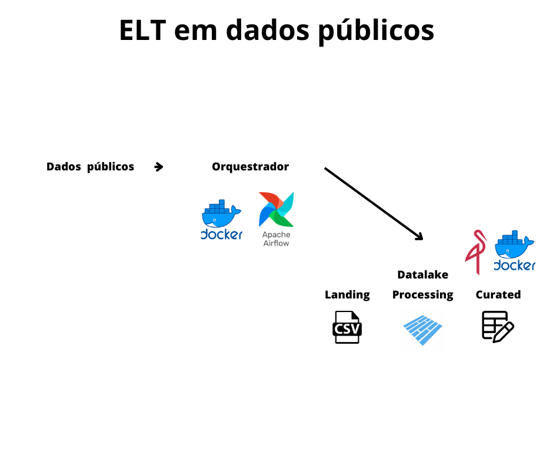

# ELT com dados publicos

## Objetivos:
- Extrair os dados e armazenar na camada landing do datalake.
- Transformar os dados para o formato parket e armazenar na camada processing.
- Realizar transformações e armazenar na cama curated do datalake.

## Infraestrutura do projeto:

## Tarefas:
- (ok) Definir os dados utilizados
- (ok) Subir o Datalake
- (ok) Subir o orquestrador 
- Criar a dag de extração
- Criar a dag de conversão de formato
- Analisar os dados e propor transformações
- Criar a dag de transformação 
- Definir e implementar agendamento do processo
